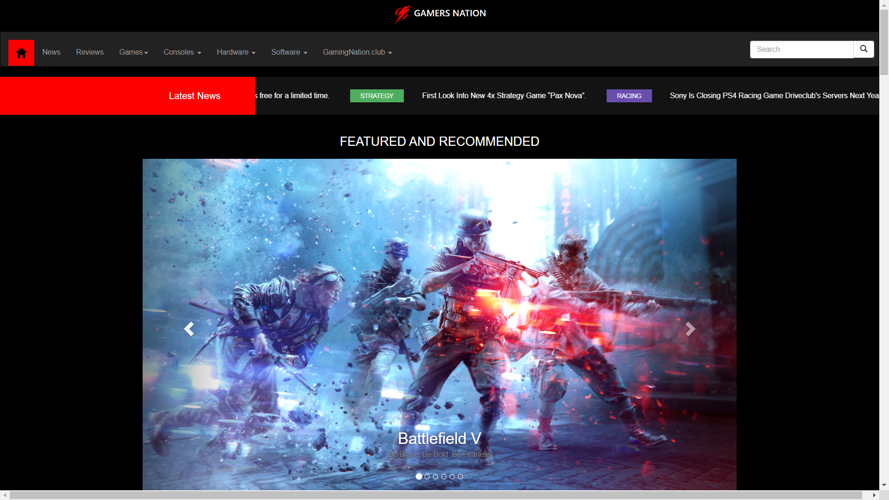
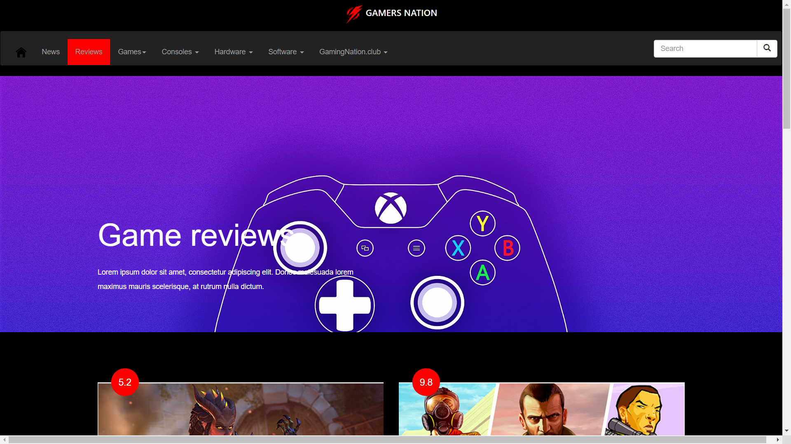
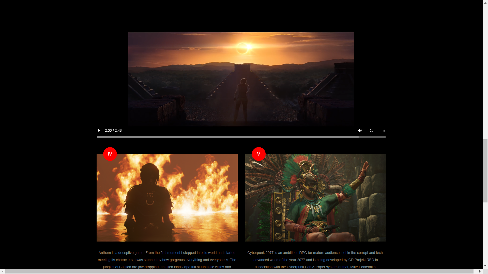
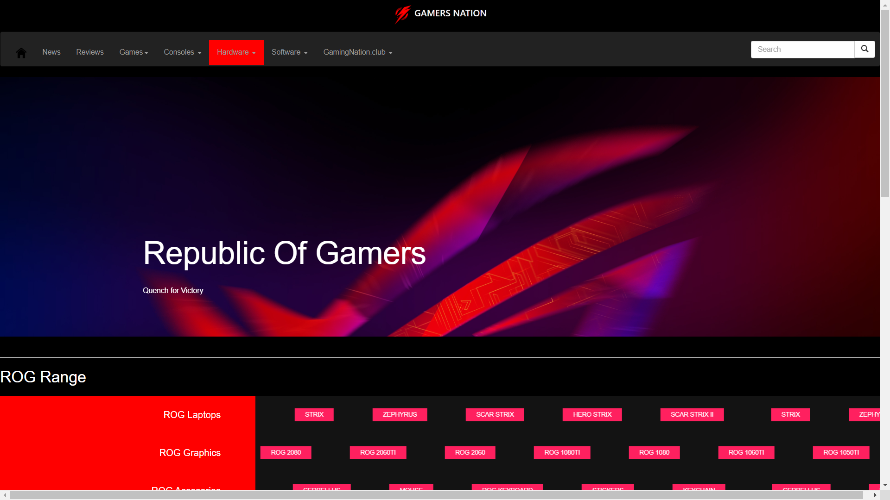

# Web development : Mini Project 

# Introduction

This is an mini project on designing frontend of an website .
This website is named as GAMERSNATION built with html,css,bootstrap,javascript ,jquery etc.

## Requirements

Any Web browser with good internet connection to enjoy the content such as images,youtube links etc used in creation

## Installation

```bash
Make sure to organise all the files in appropriate folder 
```

## Steps for running this project

1) Download/clone the repository to save all the files locally.

2) Open the "Main" folder and extract all the zip files named bootstrap,css,jquery.

3) Download Images folder through the provided google drive link(File Size : 300MB approx.)
      
 4)After assembling all the required files run the index.html file to launch the website.  
  

## More about files

The Images folder of this project is available here on [Images Folder](https://drive.google.com/open?id=1nrR6qrenAPhGQ8er_rPUoB0w18g0m-EL).

## Sample clip:


## Sample images:







